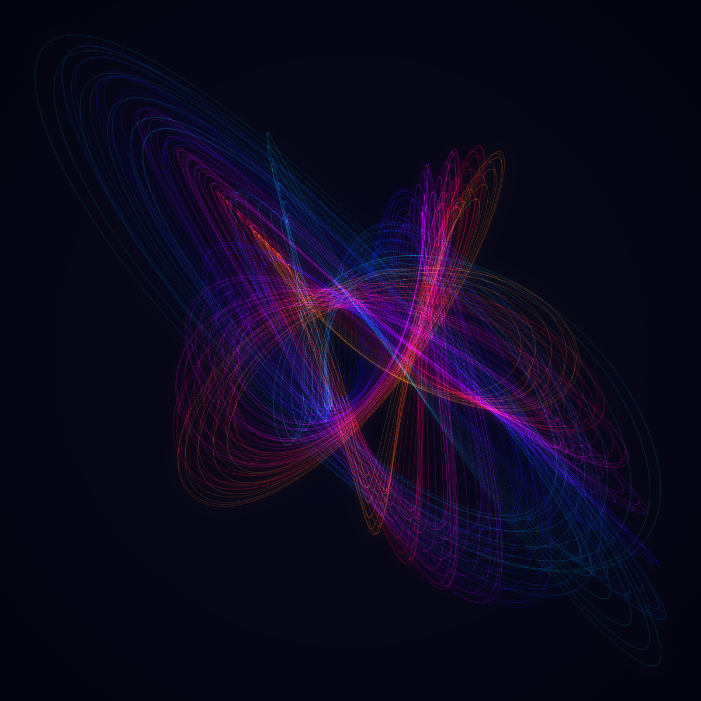
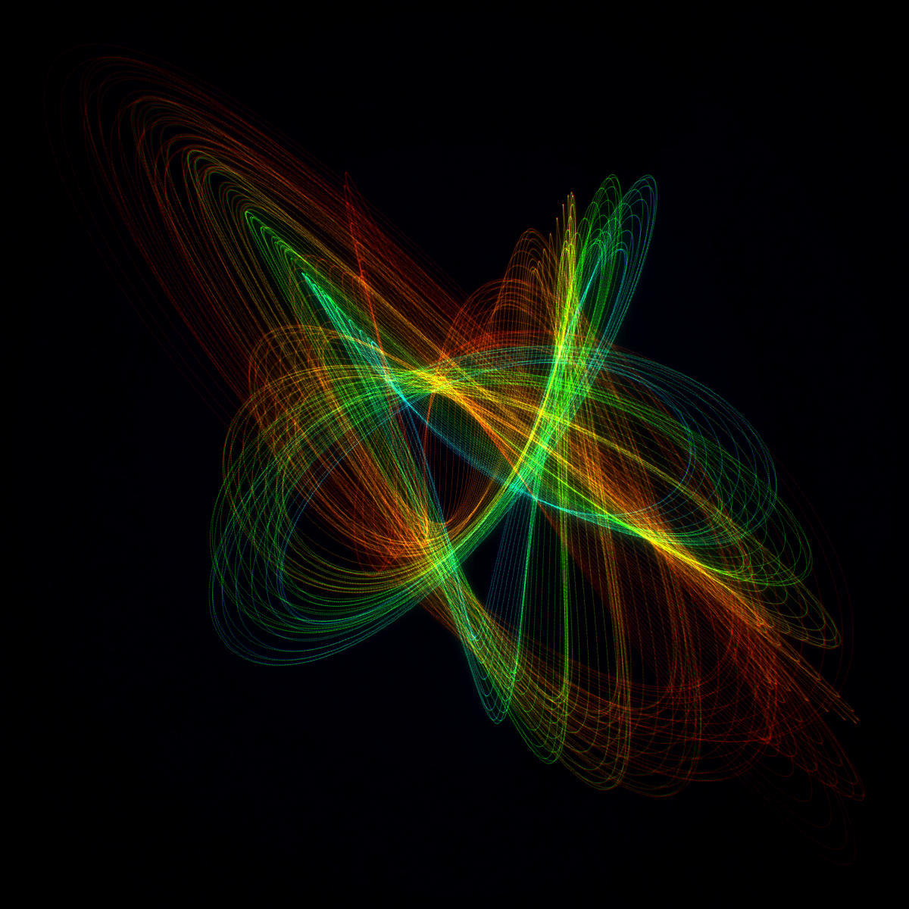
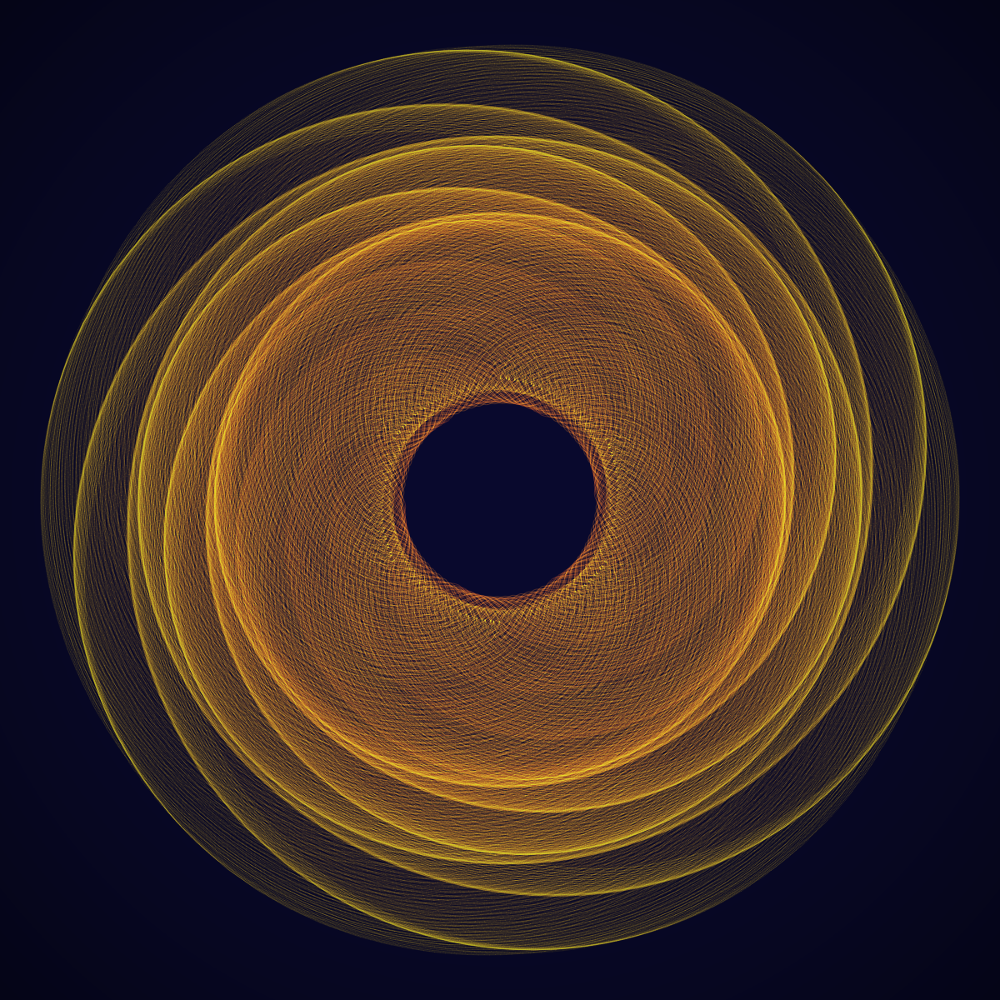
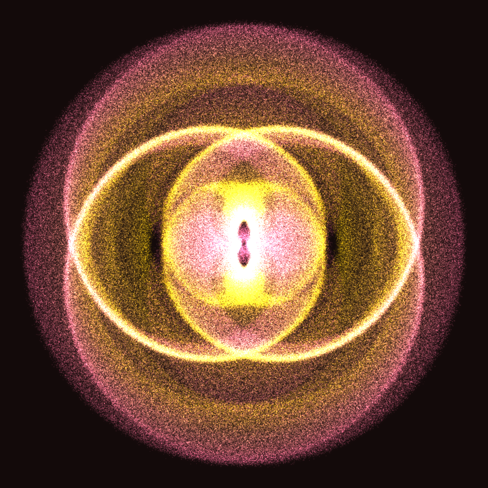
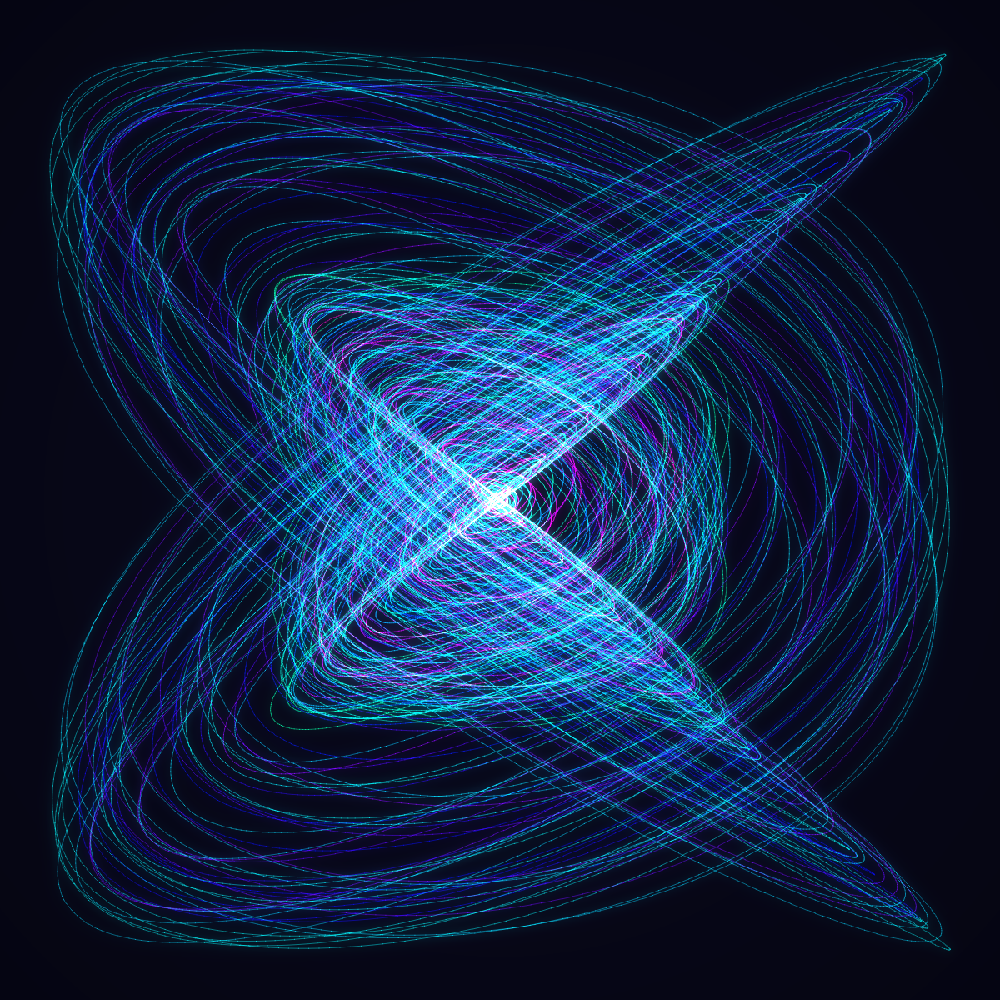

# Rhythmogram Simulator

A simulation of [Heinrich Heidersberger's](https://en.wikipedia.org/wiki/Heinrich_Heidersberger) rhythmograms — mesmerizing light-trace photographs created by 4-pendulum damped harmonographs. Heidersberger produced these abstract works from the 1950s onward by photographing the paths of light reflected from swinging pendulums, resulting in intricate, mathematically precise geometric patterns.

This desktop application lets you explore the same mathematical space interactively, with real-time animation, configurable pendulum parameters, layer compositing, 3D projection, atmospheric effects, and trail visualization.

  

<p align="center">
  
  
</p>

<p align="center">
  
  
  
</p>

## Features

### Drawing Engine
- **Real-time animation** at 60fps with progressive trace rendering
- **4-pendulum harmonograph** — adjust frequency, phase, amplitude, and damping for X1, X2, Y1, Y2 pendulums
- **Energy envelope modes** — breathe (sinusoidal pulsing), pulse (periodic energy kicks), and bounce (symmetric expansion/contraction with no net decay)
- **Continuous mode** — pendulums run indefinitely with adjustable trace fade, creating living, evolving patterns
- **Trail mode** — watch a moving point dance with a fading trail; configurable trail length, point size, and fade curve. Optionally show each pendulum's individual contribution as separate colored trails with independent lengths
- **Smart Randomize** — generates aesthetic configs with near-integer frequency ratios, optionally including FM/PM, strobe, chorus, and envelope

### Visual Effects
- **HSV color interpolation** — vibrant rainbow gradients instead of muddy RGB blending
- **3-stop gradients** — start, mid, and end colors for complex color journeys
- **10 curated palettes** — Classic Silver, Neon Plasma, Gold on Navy, Sunset Ember, Cool Moonlight, Aurora Borealis, Rose Gold, Deep Ocean, Spectral, Emerald Fire
- **Velocity-sensitive line width** — thicker where the pendulum slows, thinner at speed
- **Velocity-sensitive opacity** — brighter at turning points, mimicking real light exposure
- **5 brush types** — line, dot, airbrush (soft radial glow), chalk (scattered texture), ribbon (parallel twin lines)
- **Rotational symmetry** — 2-12 fold for mandala-like patterns
- **Mirror modes** — horizontal, vertical, or both for butterfly/kaleidoscope effects

### Advanced Physics
- **Frequency modulation (FM)** — per-pendulum FM creates sideband patterns and evolving traces
- **Phase modulation (PM)** — per-pendulum PM produces organic, swirling rosette forms
- **Duffing nonlinearity** — cubic spring term transforms precision into organic chaos (RK4 solver)
- **Light extinction / strobe** — periodic trace blanking recreating Heidersberger's strobe technique
- **Multi-trace chorus** — render 2-8 detuned copies for rich interference patterns

### Compositing and Post-Processing
- **Layer system** — stack multiple traces with different configurations, per-layer visibility and opacity
- **Live post-processing** — invert, solarize, multi-radius HDR bloom/glow, and radial vignette — all previewed in real-time
- **3D projection** — optional Z-axis pendulums with perspective distortion and auto-rotation

### Atmospheric Effects
- **Smoke glow** — noise-modulated multi-radius bloom simulating light through smoke
- **God rays** — radial light scattering from center, creating volumetric depth
- **Chromatic aberration** — radial RGB channel separation mimicking lens optics
- **Film grain** — luminance-dependent photographic grain with configurable size
- **Heat distortion** — sine-wave pixel displacement for atmospheric shimmer
- **Color grading** — split-toning (cool shadows / warm highlights) with contrast and saturation

### Tools
- **Full-screen mode** — immersive canvas-only view (F11 to toggle, Escape to exit)
- **Parametric morphing** — smoothly interpolate between two configs with play/bounce animation
- **Audio-reactive mode** — load a WAV file; spectral bands modulate pendulum amplitudes in real-time
- **Gallery generator** — auto-create grids of random configurations with random palettes for exploration
- **Zoom and pan** — scroll-wheel zoom centered on cursor, middle-click drag to pan, double-click to reset

### Export
- **PNG** — high-resolution (4096x4096) with all effects applied
- **SVG** — vector output with velocity, symmetry, mirrors, and brush types
- **Animated GIF** — capture the drawing process as animation (requires Pillow)
- **Video** — MP4 export via ffmpeg
- **Time-lapse** — accelerated frame-skipped GIF of the drawing process
- **Screenshot** — capture the full application window
- **Save/Load** — full configuration persistence as JSON

### 34 Built-in Presets

**Classic:** Classic Lissajous, Klangflache, Prelude, Fugue, Nocturne, Spirograph Decay, Orbital Bloom, Resonance, Cathedral Rose, Fibonacci Waltz, Double Helix, Quantum Interference, Silk Threads, Stargate, Tidal Drift, Mandala

**Advanced:** Stroboscope, Duffing Chaos, Chorus Nebula, Harmonic Pulse, Woven Light, Morphic Resonance, Strobe Butterfly, Atom

**Showcase:** Sacred Geometry, Frozen Lightning, Supernova, Silk Vortex, Pendulum Clock, Neon Mandala, Phantom, Event Horizon, Deep Space, Bioluminescence

## Installation

Requires Python 3.10+.

```bash
pip install PyQt6 numpy scipy
```

Optional dependencies for extended export:
```bash
pip install Pillow    # GIF and time-lapse export
# ffmpeg must be on PATH for video export
```

## Usage

```bash
python main.py
```

The application opens with a split view: the drawing canvas on the left and tabbed control panels on the right. Press **F11** for an immersive full-screen view.

### Tabs

| Tab | Purpose |
|-----|---------|
| **Pend.** | 4 pendulum parameter groups (freq/phase/amp/damping), energy envelope (breathe/pulse/bounce), Smart Randomize |
| **Visual** | Color palette, gradients (RGB/HSV), line width, brush type, velocity sensitivity, symmetry/mirrors, 3D projection, post-processing effects |
| **Phys.** | Per-pendulum FM/PM/nonlinearity, strobe frequency/duty cycle, multi-trace chorus, trail mode (length/fade/per-pendulum trails) |
| **Atmos** | Smoke glow, god rays, chromatic aberration, film grain, heat distortion, color grading |
| **Layers** | Save drawings as layers, build multi-trace compositions, per-layer opacity and visibility |
| **Preset** | 34 built-in preset thumbnails — click to load |
| **Gallery** | Auto-generate random configurations with random palettes (uses advanced features) |

### Menu Bar

| Menu | Actions |
|------|---------|
| **File** | Save/Load config, Export PNG/SVG/GIF/Video/Time-lapse, Screenshot |
| **View** | Full Screen (F11), Zoom in/out, Reset zoom |
| **Tools** | Morph between configs, Load audio file for reactive mode |

### Keyboard Shortcuts

| Key | Action |
|-----|--------|
| `F11` | Toggle full-screen mode |
| `Escape` | Exit full screen |
| `Space` | Play / Pause |
| `R` | Reset |
| `Ctrl+S` | Save config |
| `Ctrl+O` | Load config |
| `Ctrl+E` | Export PNG |
| `Ctrl+Shift+E` | Export SVG |
| `Ctrl+G` | Export GIF |
| `Ctrl+Shift+S` | Screenshot |
| `Ctrl+M` | Morph dialog |
| `Ctrl+=` / `Ctrl+-` | Zoom in / out |
| `Ctrl+0` | Reset zoom |
| Double-click | Reset zoom and pan |

## Project Structure

```
rhythmograms/
    main.py                      # Application entry point
    core/
        pendulum.py              # PendulumParams, EnvelopeConfig, HarmonographConfig
        harmonograph.py          # Numpy-vectorized engine with FM/PM, Duffing, chorus
        trace.py                 # Incremental animation with continuous mode
        trails.py                # Trail mode: ring buffer + per-pendulum decomposition
        projection.py            # 3D depth projection (Z pendulums + perspective)
        morph.py                 # Parametric config interpolation
    effects/
        color.py                 # Colors, gradients, velocity mapping, mirrors, brushes
        palettes.py              # 10 curated color palettes
        brushes.py               # 5 brush types (line, dot, airbrush, chalk, ribbon)
        postprocess.py           # Bloom, vignette, solarize, invert
        atmosphere.py            # Smoke glow, god rays, chromatic aberration, grain, heat, grading
        composite.py             # Additive exposure blending
    gui/
        app.py                   # Main window, menu bar, full-screen, signal wiring
        canvas.py                # Drawing surface with layers, trails, zoom, 3D, audio
        trace_renderer.py        # Rendering with brushes, symmetry, mirrors
        controls.py              # Pendulum sliders + envelope controls
        effects_panel.py         # Visual settings (colors, drawing, effects, 3D)
        physics_panel.py         # FM/PM, nonlinearity, strobe, chorus, trail mode
        atmosphere_panel.py      # Atmospheric effect controls
        toolbar.py               # Transport + continuous mode controls
        layers_panel.py          # Layer stack management
        gallery_panel.py         # Auto-generated random gallery
        morph_dialog.py          # Morph animation dialog
        presets_panel.py         # Preset thumbnail grid
        style.py                 # Dark theme stylesheet
    utils/
        config.py                # JSON save/load
        export.py                # PNG and SVG export
        animation_export.py      # GIF, video, and time-lapse export
        audio.py                 # WAV spectral analysis for reactive mode
    presets/                     # 34 built-in preset JSON files
    examples/                    # Example renders
```

## How It Works

A rhythmogram is the trace of a point whose x and y coordinates are each the sum of two damped sinusoids:

```
x(t) = A1 * sin(f1(t)*t + p1(t)) * env(t,d1) + A2 * sin(f2(t)*t + p2(t)) * env(t,d2)
y(t) = A3 * sin(f3(t)*t + p3(t)) * env(t,d3) + A4 * sin(f4(t)*t + p4(t)) * env(t,d4)
```

Where:
- `f_i(t)` may include **frequency modulation**: `f0 + depth * sin(2*pi*fm_freq*t)`
- `p_i(t)` may include **phase modulation**: `p0 + depth * sin(2*pi*pm_freq*t)`
- `env(t, d)` is the amplitude envelope — either pure exponential damping `exp(-d*t)` or a modulated variant:
  - **Breathe**: `exp(-d*t) * (0.5 + 0.5*cos(2*pi*f*t))` — smooth pulsing
  - **Pulse**: `exp(-d*(t mod T))` — periodic energy injection
  - **Bounce**: sine-eased triangle wave — symmetric expansion/contraction
- Optional **Duffing nonlinearity** adds a cubic restoring force term, computed via RK4 integration
- **Strobe** blanks the trace periodically at configurable frequency and duty cycle
- **Chorus** renders N frequency-detuned copies for interference patterns

The interplay of these parameters produces an enormous variety of patterns — from simple Lissajous figures to complex spiraling forms, breathing mandalas, strobed geometric petals, and endlessly evolving continuous traces.

**Trail mode** shows the point's live motion with a fading tail, and can decompose the trace into its four individual pendulum contributions with independently configurable trail lengths.

Optional **3D depth** is added via two Z-axis pendulums with perspective projection. **Atmospheric effects** (smoke glow, god rays, chromatic aberration, film grain, heat distortion, color grading) simulate light passing through smoke and atmosphere.

## Acknowledgments

Inspired by the work of Heinrich Heidersberger (1906-2006), whose rhythmograms bridged art and mathematics through the elegant physics of pendulum motion.
